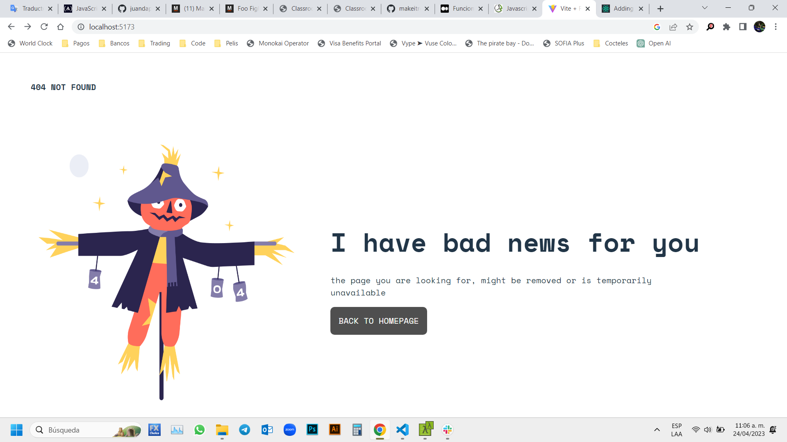

# Make It Real - My first React App
## This is a solution to the *React* project of the Make It Real course.

## The challenge
Take a build 404-Not found excercise page and construct a new page using React

## Screenshot

## My process
### Built with
- Semantic markup using vscode editor
- React code using vite in vs code
- CSS properties in a stylesheet file

## What I learned
I learn and practice how to create a React page

## Author
Juan David Peña  
github - @juandape  
email - juandavidp76@hotmail.com  

## Acknowledgments
Thanks to Make it Real to show me a path to become a better programmer